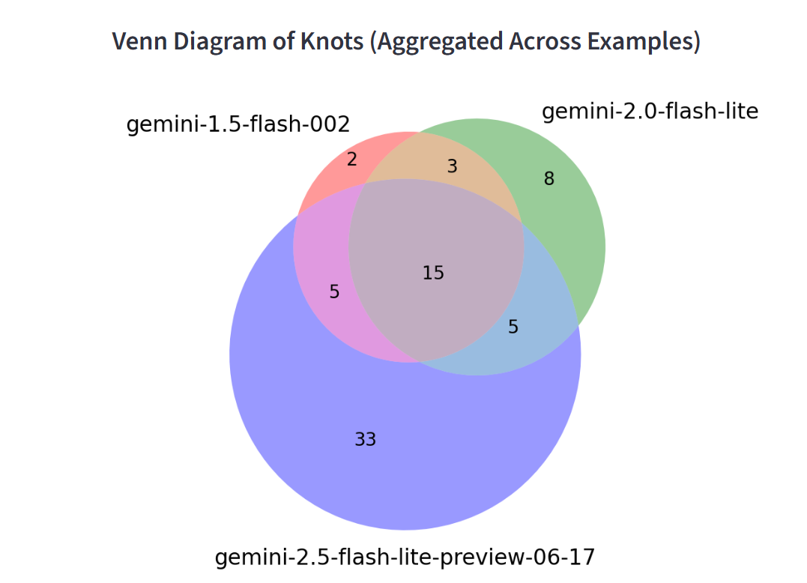

# Model Comparison Tool

A Streamlit-based web application for comparing the performance and outputs of different AI models across multiple examples. This tool visualizes key metrics and enables side-by-side comparison of model responses.

## Features

- **Multi-Model Comparison**: Compare up to three different AI models simultaneously
- **Aggregated Metrics**: View total and average token usage, costs, and unique entities
- **Visualization**:
  - Summary tables with key metrics
  - Bar charts showing unique knots per model
  - Venn diagrams displaying overlap between model outputs
- **Detailed Analysis**: Per-example breakdown of model performance and outputs
- **Entity Recognition**: Display of named entities identified by each model




## Installation

1. Clone the repository:
   ```
   git clone https://github.com/yourusername/comparison_models.git
   cd comparison_models
   ```

2. Create and activate a virtual environment:
   ```
   python -m venv venv
   # On Windows
   venv\Scripts\activate
   # On macOS/Linux
   source venv/bin/activate
   ```

3. Install dependencies:
   ```
   pip install -r requirements.txt
   ```

## Usage

1. Place your model response JSON files in the appropriate directories:
   - `comparison_models/model_1/` - for the first model
   - `comparison_models/model_2/` - for the second model
   - `comparison_models/model_3/` - for the third model

2. Run the Streamlit application:
   ```
   streamlit run comparison_models/streamlit.py
   ```

3. Open your browser and navigate to the URL displayed in the terminal (typically http://localhost:8501)

## Data Format

The application expects JSON files with the following structure:
```json
{
  "status": "completed",
  "message": {
    "keywords_named_entities": ["entity1", "entity2", ...],
    "knots_from_section": [["knot1"], ["knot2", "knot3"], ...],
    "model_info": {
      "name": "model-name",
      "tokens": {
        "input": 1000,
        "output": 500,
        "total": 1500
      },
      "cost": 0.00123
    }
  }
}
```

## Requirements

- Python 3.6+
- Streamlit
- Pandas
- Matplotlib
- matplotlib_venn

